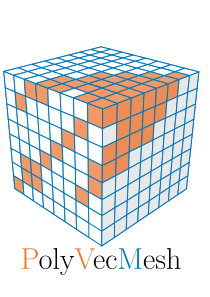

[](https://github.com/CurrencyFinn/PolyVecMesh/blob/main/LICENSE)
[](https://github.com/CurrencyFinn/PolyVecMesh/releases/)



PolyVecMesh is a lightweight tool for visualising CFD polyhedral and hexahedral meshes in 2D vector format. It converts meshes exported from ParaView (VTK Multi-Block format) into clean, publication-quality (vector format) graphics that can be plotted directly with matplotlib.

This enables high-resolution, scalable mesh figures, something that is not easily achievable in ParaView for vector graphics.

### Requirements
- Mesh exported from ParaView as VTK Multi-Block
- Python ≥3.8

### Python Dependencies
- numpy
- matplotlib
- xml

## Mesh Visualisations

<p align="center">
  <span style="margin-right:10px;">
    
  </span>
  <span>
    
  </span>
</p>

## Usage

1. In ParaView, create a 2D slice of your mesh.  
2. Export the slice as XML Multi Block Data (`.vtm`) with Data Mode: ASCII.  
3. In Python, load the file using the `PolyVecMesh` class.  
4. Generate the mesh line data using `createCollection()`.  
5. Pass the resulting array into a `matplotlib.collections.LineCollection` for plotting.

Example (see the `examples` folder for full scripts):
```python
from PolyVecMesh import PolyVecMesh as pvm
import matplotlib.pyplot as plt
from matplotlib.collections import LineCollection

if __name__ == "__main__":
    vtkFile = r"resources\topview\topview_0_0.vtu"
    pvm = pvm(vtkFile)

    _, ax = plt.subplots(figsize=(10, 10))
    meshLines = pvm.createCollection()

    cellLineCollection = LineCollection(meshLines, linewidths=0.5)
    ax.add_collection(cellLineCollection, autolim=True)

    ax.autoscale(enable=True, tight=True)
    ax.set_aspect("equal", adjustable="box")

    plt.show()
```

## TODO

### Functionality
- [ ] Multi-region support + VTK colouring
- [ ] Smarter detection of cells outside the slice plane when using implicit clipping
    - e.g., pre-filter points with a large deviation from the normal
    - introduce a `maxDistanceOffSlice` threshold
- [ ] Auto-detect `maxDistanceOffSlice` (essentially a custom slicing tool)
- [ ] Select only front faces, boundary layer collapse, motorbike case issues
    - e.g., compute face node average for all faces, remove those below the plane that lower the total average.
    - e.g., select faces with normals aligned with the plane normal; check if it works for back faces when polyhedron normals point outward.
- [ ] Include off-normal 2D plane creation, now only a plane can be made in the mesh aligned with the axis
    - e.g., rotate all points until it is aligned with the axis to remove excess points.
### Optimization
- [ ] Skip faces/edges whose normals deviate strongly from the slice normal
- [ ] Improve hexahedral handling: assign faces individually and use uniqueness  
      to filter overlapping faces with polyhedral cells

## License

[MIT](https://github.com/CurrencyFinn/PolyVecMesh/blob/main/LICENSE)


